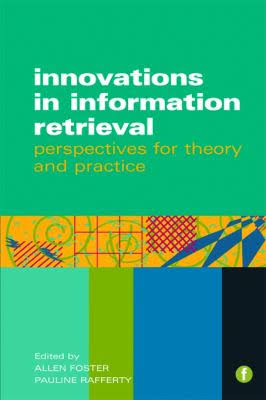

## Dílo

Jeho dosavadní dílo se skládá především ze dvou knih a deseti článků. Na knihách spolupracoval s Pauline Rafferty.

Kniha ***Innovations in Information Retrieval: Perspectives for Theory and Practice*** byla vydána v červenci roku 2011 nakladatelstvím *Facet Publishing*.

Příchod nových technologií v rámci informačního vyhledávání a přístupů k uchovávání a vyhledávání poskytuje komunitám dříve nepoznané možnosti a příležitosti pro masovou dokumentaci, digitalizaci a nahrávání informací v každé její formě. Tato kniha představuje a kontextualizuje tento vývoj a zaměřuje se také na podporu výzkumu v oblasti IR, na debaty, teorie a problémy (otázky).

Na základě příspěvku mezinárodního týmu odborníků vytváří každá kapitola přehled o změnách v oboru a také důležitost rozvoje inovací, kreativity a myšlení v praxi a výzkumu. Mezi klíčové oblasti diskuse patří:

* Prohlížení nových informačních prostředí (*Browsing in new information environments*)
* Klasifikace revidována: síť vědomostí (*Classification revisited: a web of knowledge*)
* Přístupy výzkumu k fikčnímu vyhledávání (*Approaches to fiction retrieval research*)
* Výzkum hudebního informačního vyhledávání (*Music information retrieval research*)
* Folksonomie, sociální značky a informační vyhledávání (*Folksonomies, social tagging and information retrieval*)
* Digitální informační interakce jako sémantická navigace (*Digital information interaction as semantic navigation*)
* Posuzování webových vyhledávacích nástrojů: webometrický přístup (*Assessing web search machines: a webometric approach*)

 

Zdroje:

1) [WikiKnihovna](http://wiki.knihovna.cz/index.php/Allen_Foster)  

2) [Innovations in Information Retrieval: Perspectives for Theory and Practice](https://books.google.cz/books?id=ut4qDgAAQBAJ&lpg=PR9&dq=professor%20allen%20foster%20work&hl=cs&pg=PR9#v=onepage&q=professor%20allen%20foster%20work&f=false)

 
 